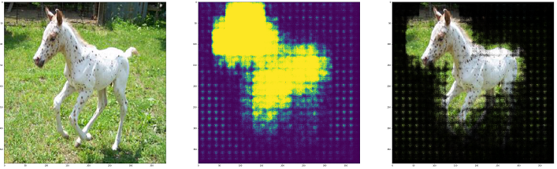
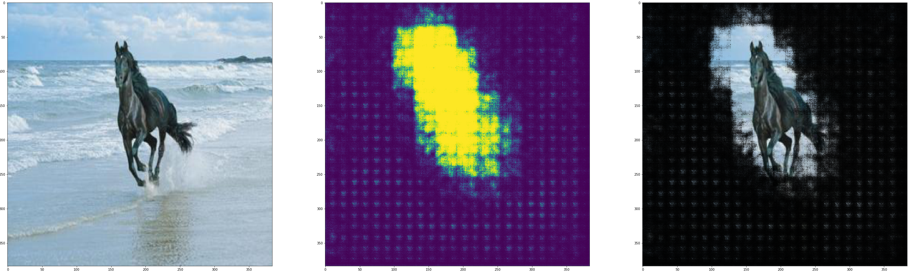
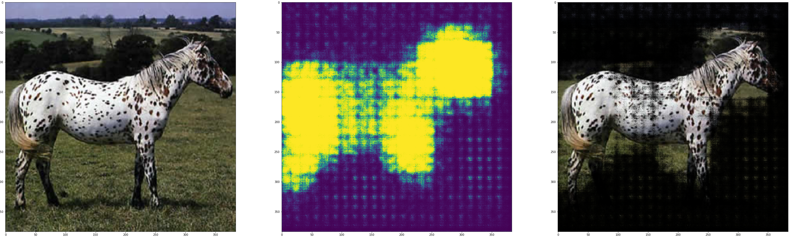
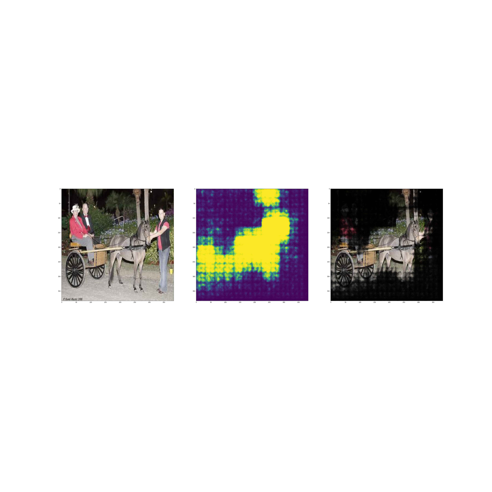

# Co-attention CNNs for Unsupervised Object Co-segmentation

## Description

This is my partial implementation of the paper: **Co-attention CNNs for Unsupervised Object Co-segmentation** by Kuang-Jui Hsu, Yen-Yu Lin, and Yung-Yu Chuang  
Paper link:  
https://www.csie.ntu.edu.tw/~cyy/publications/papers/Hsu2018CAC.pdf

## Results

## Dependencies
- Pytorch 1.3.1
- Tensorboard
- Numpy
- Matplotlib
## Details
I used FCN32s implementation available at https://github.com/pochih/FCN-pytorch

The system was trained on the Internet Dataset http://people.csail.mit.edu/mrub/ObjectDiscovery/  
I used the subset of this dataset, that is stored in following folders:
- Airplane100
- Horse100
- Car100

